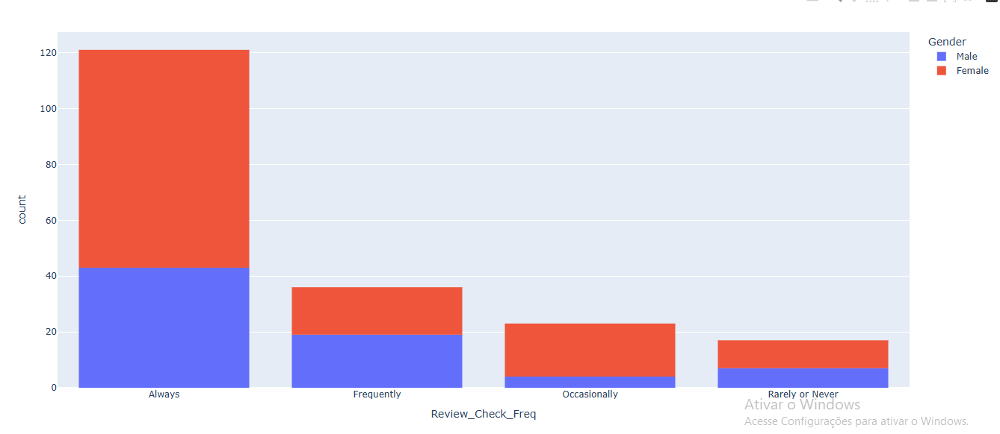

<h1 align="center">Análise dos Requisitos para um E-Commerce</h1>

 Análise sobre os requisitos mais atraentes/importantes para os consumidores e usuários. 

  <a href="#-tecnologias">Tecnologias</a>&nbsp;&nbsp;&nbsp;|&nbsp;&nbsp;&nbsp;
  <a href="#-projeto">Projeto</a>&nbsp;&nbsp;&nbsp;|&nbsp;&nbsp;&nbsp;
  <a href="#-aprendizado">Aprendizado</a>&nbsp;&nbsp;&nbsp;|&nbsp;&nbsp;&nbsp;
  <a href="#-conclusão">Conclusão</a>&nbsp;&nbsp;&nbsp;|&nbsp;&nbsp;&nbsp;
  <a href="#-licença">Licença</a>

  

 

  

---
## 🚀 Tecnologias

Esse projeto foi desenvolvido com as seguintes tecnologias:

- Python
- Pandas
- Plotly
- Análise de Dados
- Excel

---
## 💻 Projeto

Projeto de análise de dados, 

---
## 📑 Aprendizado

Durante esse projeto aprendi: 
- Importar e usar libs utilizando pip
- Importar e ler dados, arquivos externos
- Remover linhas que contenham dados corrompidos ou faltando
- Estruturas de repetição em python para gerar gráficos de cada coluna 
- Tratar e compilar os dados importados
- Criar gráficos para visualizar os dados com facilidade

---
## ✅ Conclusão
Após analisar os dados e gráficos fornecidos, conclui que existem 3 requisitos essenciais:

- Quando maior o número de avaliações e reviews que o produto possui, maior a chance do consumidor realizar a compra;
- Ter opção para o cliente realizar o pagamento em dinheiro;
- Quanto maior a segurança do site, maior a chance do cliente confiar em comprar;

Possíveis Soluções:
-
- Para aumentar a confiança do cliente em comprar no site, a empresa pode mostrar os selos de segurança no rodapé do site;
- Oferecer a opção para o cliente realizar o pagamento com o PIX ou em dinheiro na entrega;
- Oferecer algum desconto na proxima compra para clientes que realizam avaliação de produtos que já compraram.

---
## 📝 Licença

Esse projeto está sob a licença MIT.

---